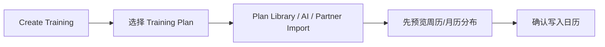
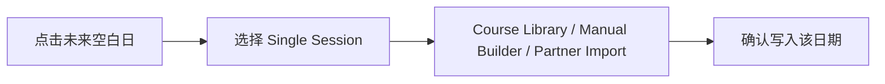

# Suunto Training Calendar 交互框架规格

## 1. 文档目标
将当前以“运动记录查看”为主的 `Calendar` 重构为 `Training Calendar`，成为用户训练的过去、现在、未来统一承载模块，并为课程创建、计划生成、导入同步提供清晰的进入方式。

本规格服务于产品、交互、研发对齐，重点回答：
- 模块在信息架构中的新定位是什么
- 首页、日期详情、计划详情分别承担什么职责
- 计划库、课程库、AI、手动创建、第三方同步如何整合进同一模块
- 用户在不同时间状态下应该看到什么、能做什么

## 2. 模块定位
`Training Calendar` 是训练中枢，不是单独的新频道。

核心角色：
- 过去：记录完成过的训练及其完成结果
- 现在：突出今天该做什么，以及是否需要同步、调整、补做
- 未来：承载未来计划与单次课程安排

核心原则：
- 先回答“今天要做什么”
- 再解释“我正在执行什么计划”
- 最后提供“我要如何生成更多训练”

## 3. 顶层信息架构
取消现有 `Diary / My plan` 的割裂结构，合并为一个主视图。

### 顶层导航
- 底部导航仍保留日历入口
- 入口标题升级为 `Training` 或 `Training Calendar`
- 模块内顶部提供三种时间视图：
  - `Week`
  - `Month`
  - `Plan View`

### 视图职责
- `Week`：聚焦执行效率，适合今天训练、补课、换课
- `Month`：聚焦节奏与密度，适合看完成率、负荷分布、休息/补课
- `Plan View`：聚焦阶段目标，适合理解当前周次与未来关键训练

## 4. 首页结构
首页由三层信息组成。

### 4.1 顶部摘要区
目标：用一屏内的信息回答“我现在处于什么计划、进展如何、下一个关键训练是什么”。

包含：
- 当前计划名称
- 计划目标
- 当前周次
- 本周完成率
- 下一次关键训练
- `Create Training` 主动作入口

### 4.2 中部日历区
目标：用时间轴承载训练状态，而不是仅承载活动发生与否。

每一天需要表达：
- 是否已经完成
- 是否是今天待做
- 是否是未来计划中
- 是否为空白可排
- 是否为休息日
- 是否为调整/补课状态
- 是否来自第三方导入

### 4.3 底部详情区 / 日期详情页
目标：当用户点到某一天时，不离开时间轴就能快速进入这一天的训练动作。

展示内容：
- 日期与状态
- 单次训练标题与目标
- 计划来源
- 是否已同步到手表
- 当天可执行动作
- 所属计划入口

## 5. 三个核心页面
### 5.1 Training Calendar 首页
负责：
- 看今天任务
- 看整体计划节奏
- 切换 Week / Month / Plan View
- 发起创建训练

不负责：
- 复杂课程编辑
- 复杂计划配置
- 三方同步授权细节

### 5.2 日期详情页 Day Sheet
不同日期类型下的信息重心不同。

过去日期：
- 训练结果
- 完成情况
- 复盘入口
- 回看计划进度

今天日期：
- 训练任务
- 课程结构预览
- 同步到手表
- 调整日期

未来日期：
- 已计划课程内容
- 替换课程
- 调整时间
- 对空白位新增单次训练

### 5.3 计划详情页
负责解释“为什么这个训练出现在这里”。

展示：
- 计划名称与目标
- 总周期与当前周次
- 阶段安排
- 本周关键训练
- 计划来源：模板 / AI / 手动 / 第三方
- 同步状态

## 6. 日历状态体系
建议最小状态集合如下：

| 状态 | 含义 | 首页动作重点 |
| --- | --- | --- |
| `completed` | 已完成训练 | 复盘、回看计划 |
| `today` | 今日待完成 | 执行、同步、预览 |
| `planned` | 未来已安排 | 同步、替换、调整 |
| `rest` | 休息日 | 查看安排原因 |
| `moved` | 延后/补课 | 调整、补排 |
| `partner` | 来源于第三方 | 统一展示为 Suunto 训练对象 |
| `blank` | 空白可安排 | 新增课程或导入 |

视觉原则：
- 已发生的内容用“结果态”表达
- 待执行内容用“任务态”表达
- 来源只做标签，不抢占状态主语义

## 7. 创建训练入口体系
所有“向未来写入训练”的能力收敛到一个统一入口：`Create Training`。

### 第一层：选择对象
- `Training Plan`
- `Single Session`

### 第二层：选择生成方式
当对象是 `Training Plan` 时：
- `Plan Library`
- `AI Plan Builder`
- `Import Partner Plan`

当对象是 `Single Session` 时：
- `Course Library`
- `Manual Builder`
- `Import Partner Session`

### 入口落点
- 首页顶部入口：适合创建整段计划
- 空白未来日期：适合创建单次课程
- 已计划日期：适合替换课程或补课

## 8. 核心用户流程
### 流程 A：看今天该做什么

### 流程 B：创建未来训练计划

### 流程 C：给空白日补一节课

### 流程 D：复盘过去训练

## 9. 对象定义
### Training Day
- 日期
- 状态
- 是否属于某计划
- 是否已同步到手表
- 来源类型：模板 / AI / 手动 / 第三方
- 是否可执行 / 可调整 / 可补排

### Training Plan
- 计划目标
- 周期长度
- 当前周次
- 关键训练列表
- 来源类型
- 与日期映射关系

### Training Session / Course
- 单次训练内容
- 热身 / 主训练 / 恢复 / 休息段结构
- 用途：单次安排 / 计划内复用 / 手表同步

### Create Training Entry
- 对象选择：计划 / 单课
- 方式选择：库 / AI / 手动 / 导入
- 写入动作：预览写入 / 直接写入 / 保存为模板

## 10. 关键交互准则
- 首页不能先让用户判断“我是来看记录还是来看计划”，而是直接给出训练时间线。
- 所有来源最终都必须落成统一训练对象，进入日历后不保留割裂体验。
- 空白未来日期必须允许用户直接添加单课，而不是被迫新建整段计划。
- 计划生成必须先预览再写入，避免 AI 或导入结果直接污染时间线。
- Day Sheet 要根据过去、今天、未来切换动作优先级，而不是复用同一模板。

## 11. 边界与默认决策
- 本期以跑步训练为首要心智模型
- 三方同步作为内容来源之一，不做独立首页入口
- 恢复/睡眠/资源等 readiness 信号本期不进入主叙事
- 首页承载信息，不承载复杂编辑
- 复杂创建、编辑、导入通过子页面或抽屉完成

## 12. 验收场景
- 无训练计划用户进入首页后，仍可继续查看记录且不会被复杂入口打扰
- 已有 10 周计划的用户能一眼看到当前周次、今日任务、未来关键课
- 用户点击未来空白日期后可以直接添加单次课程
- AI 生成计划会先进入日历预览态，再由用户确认写入
- RQrun 等第三方导入课程进入日历后，能以统一训练对象展示并支持手表同步
- 用户切换 Week / Month / Plan View 时，不会迷失今天任务与计划上下文
